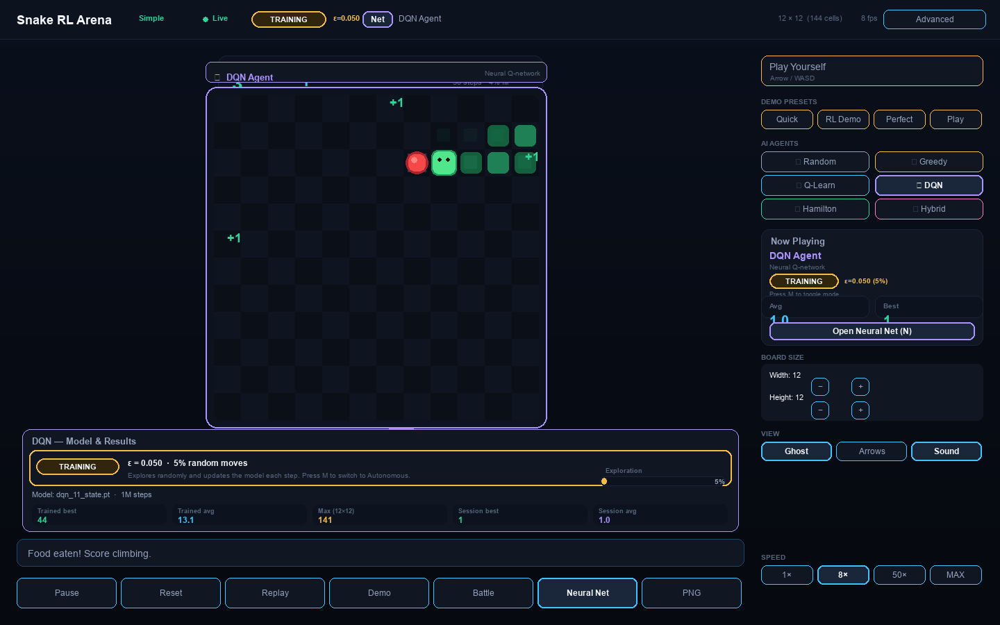
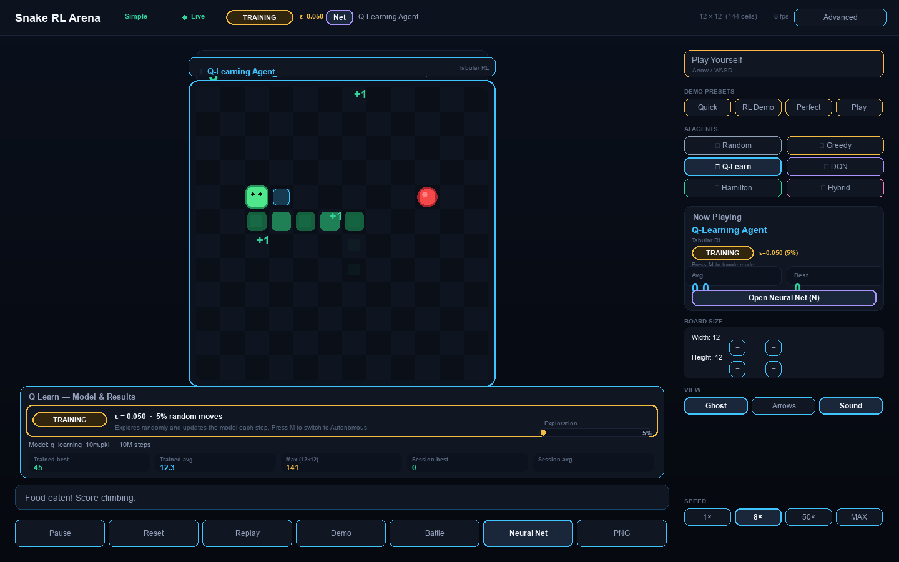
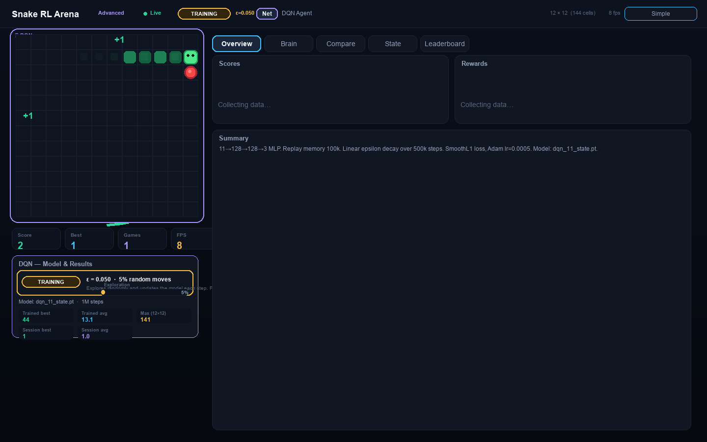
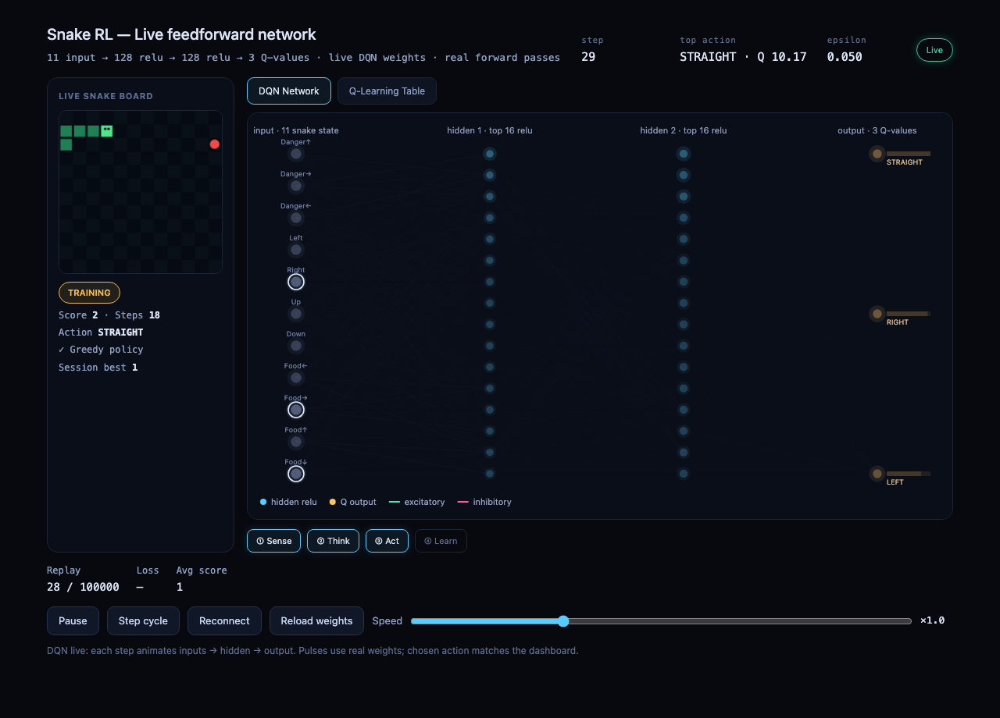
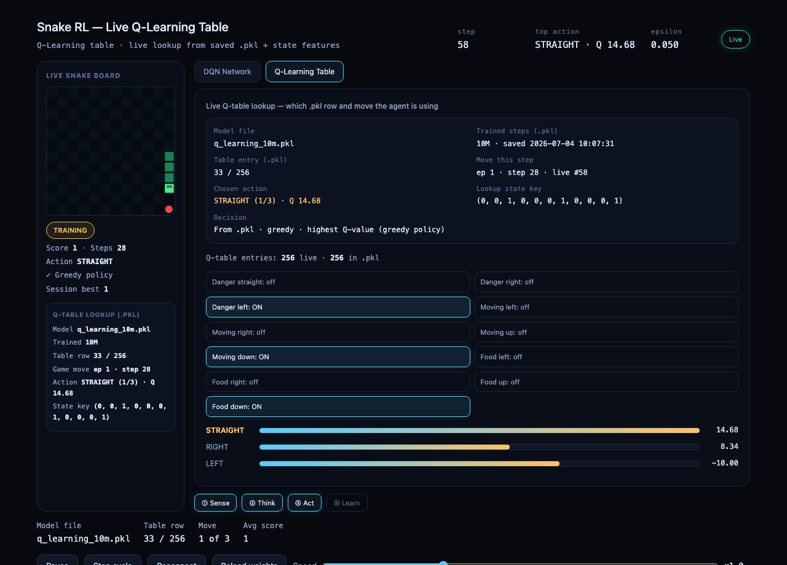

<p align="center">
  
</p>

<h1 align="center">Snake Neural Playground</h1>

<p align="center">
  <strong>Train, battle, and watch AI agents play Snake — with a live neural-network view synced to every move.</strong>
</p>

<p align="center">
  <a href="https://www.python.org/"></a>
  <a href="https://pytorch.org/"></a>
  <a href="https://www.pygame.org/"></a>
  <a href="https://github.com/Sheheryargit/snake-neural-playground"></a>
</p>

<p align="center">
  <a href="#-screenshots">Screenshots</a> ·
  <a href="#-quick-start">Quick Start</a> ·
  <a href="#-agents">Agents</a> ·
  <a href="#-live-visualization">Live Viz</a> ·
  <a href="#-training">Training</a>
</p>

---

## What is this?

**Snake Neural Playground** is a reinforcement learning lab for the classic Snake game. It combines:

- A **pygame dashboard** for running agents, tuning speed, battling head-to-head, and inspecting model stats
- **Headless training** for tabular Q-Learning and deep Q-networks
- A **live browser visualization** that streams every game step over SSE — animating DQN forward passes or showing exactly which `.pkl` Q-table row the agent looked up

Perfect for learning how RL agents perceive state, choose actions, and improve over time — with visuals, not just logs.

---

## ✨ Features

| | |
|---|---|
| 🎮 **7 agents** | Random, Greedy, Q-Learning, DQN, Hamiltonian, Hybrid, Manual |
| 📊 **Rich dashboard** | Simple & advanced UI, battle mode, presentation mode, PNG export |
| 🧠 **Live neural viz** | Step-synced DQN pulse animation at `localhost:8765` |
| 📋 **Q-table inspector** | Model file, table row, state key, action (1–3) per step |
| 💾 **Pre-trained models** | `q_learning_10m.pkl` and `dqn_11_state.pt` included |
| ⚙️ **Configurable board** | Resize grid, training/autonomous toggle, ε-greedy control |

---

## 📸 Screenshots

### Dashboard — DQN agent (Advanced UI)

<p align="center">
  
</p>

<p align="center"><em>Run agents, inspect training stats, and open the live neural view — all from one arena.</em></p>

<table>
  <tr>
    <td width="50%">
      
      <p align="center"><strong>Q-Learning</strong><br><sub>Tabular RL with live ε and session stats</sub></p>
    </td>
    <td width="50%">
      
      <p align="center"><strong>Advanced mode</strong><br><sub>Charts, brain tab, and deep metrics</sub></p>
    </td>
  </tr>
</table>

### Live browser visualization

<table>
  <tr>
    <td width="50%">
      
      <p align="center"><strong>DQN Network</strong><br><sub>Inputs → hidden layers → Q-values, synced per step</sub></p>
    </td>
    <td width="50%">
      
      <p align="center"><strong>Q-Learning Table</strong><br><sub>.pkl row lookup, state features, and Q bars</sub></p>
    </td>
  </tr>
</table>

---

## 🚀 Quick Start

### Prerequisites

- Python 3.9+
- macOS, Linux, or Windows

### Install

```bash
git clone https://github.com/Sheheryargit/snake-neural-playground.git
cd snake-neural-playground

python -m venv .venv
source .venv/bin/activate        # Windows: .venv\Scripts\activate

pip install -r requirements.txt
pip install -e .
```

### Run the dashboard

```bash
python scripts/watch_agents.py
```

### Essential controls

| Key | Action |
|-----|--------|
| `1`–`6` | Select agent |
| `H` | Play manually |
| `N` | Open live neural / Q-table view in browser |
| `M` | Toggle Training ↔ Autonomous |
| `B` | Battle mode |
| `TAB` | Simple ↔ Advanced UI |
| `SPACE` | Pause · `R` Reset · `S` Save model |

---

## 🧠 Live Visualization

1. Press `3` (Q-Learning) or `4` (DQN)
2. Press `N` or click **Neural Net**
3. Browser opens at **`http://127.0.0.1:8765/`**

| Mode | What you see |
|------|----------------|
| **DQN** | 11 input neurons light up → pulses through 128→128 hidden → output Q-values |
| **Q-Learning** | Which `.pkl` file, table row (`142 / 256`), state key, and chosen action |

Each snake step triggers one fresh forward-pass animation — no looping demo data.

---

## 🤖 Agents

| # | Agent | Type | Best (12×12) | Model |
|---|-------|------|-------------|-------|
| 1 | Random | Baseline | ~15 | — |
| 2 | Greedy Food | Rule-based | ~68 | — |
| 3 | Q-Learning | Tabular RL | ~45 | `q_learning_10m.pkl` |
| 4 | DQN | Deep RL | ~44 | `dqn_11_state.pt` |
| 5 | Hamiltonian | Planner | 141 | — |
| 6 | Hybrid Hamiltonian | Planner | 141 | — |
| 7 | Manual | Human | — | Arrow keys / WASD |

---

## 📐 State & Rewards

**11-dim simple state** (used by Q-Learning & DQN):

| Index | Feature |
|-------|---------|
| 0–2 | Danger straight / right / left |
| 3–6 | Direction left / right / up / down |
| 7–10 | Food left / right / up / down |

**Rewards:** `+10` eat food · `-10` collision · `-0.01` per step · `+100` fill board

---

## 🏋️ Training

```bash
# Q-Learning — 10M steps
python scripts/train_q_learning.py --steps 10000000

# DQN — 1M steps
python scripts/train_dqn.py --steps 1000000

# Inspect a saved Q-table
python scripts/inspect_pkl.py models/q_learning_10m.pkl
```

<details>
<summary><strong>Hyperparameters</strong></summary>

**Q-Learning:** α=0.1 · γ=0.9 · ε decay 0.995/ep · min ε=0.05

**DQN:** 11→128→128→3 · Adam 5×10⁻⁴ · replay 100k · batch 128 · γ=0.95 · target update every 5k steps

</details>

---

## 🏗️ Architecture

```
┌─────────────────────┐     SSE / HTTP      ┌──────────────────────────┐
│  watch_agents.py    │ ──────────────────► │  neural-network-live.html │
│  (pygame dashboard) │   localhost:8765    │  (browser visualization)  │
└─────────┬───────────┘                     └──────────────────────────┘
          ▼
   SnakeEnv → QLearningAgent / DQNAgent
```

Each step publishes JSON: `step_id`, board, state vector, Q-values, activations, and `.pkl` lookup metadata.

---

## 📁 Project Structure

```
snake-neural-playground/
├── src/snake_rl/          # Environment, agents, replay memory
├── scripts/
│   ├── watch_agents.py    # Main dashboard
│   ├── train_*.py         # Headless training
│   └── ui/                # Dashboard + neural bridge
├── web/
│   └── neural-network-live.html
├── docs/images/           # README screenshots
└── models/                # Checkpoints & logs
```

---

## 🛠️ Development

```bash
python scripts/test_env.py                              # Smoke test
python scripts/capture_readme_screenshots.py            # Regenerate README images
```

Regenerating screenshots requires `pip install playwright && playwright install chromium`.

---

## Roadmap

- [x] README screenshots
- [ ] CI pipeline for training smoke tests
- [ ] GIF / video demo
- [ ] Docker one-click setup
- [ ] Advanced-state DQN agent

---

## Contributing

Issues and pull requests are welcome on [GitHub](https://github.com/Sheheryargit/snake-neural-playground).

---

<p align="center">
  Built by <a href="https://github.com/Sheheryargit">Sheheryar</a> · Exploring tabular Q-learning, deep Q-networks, and real-time RL visualization
</p>
